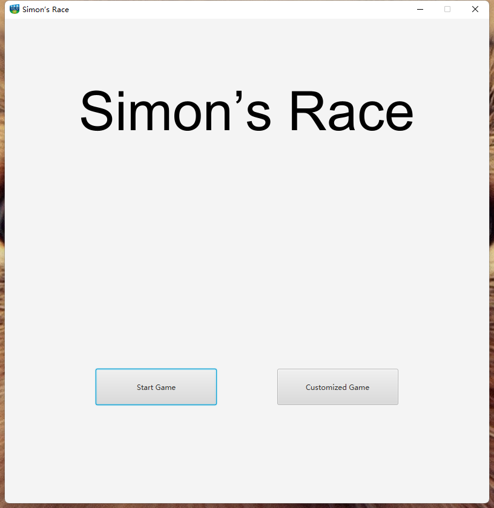
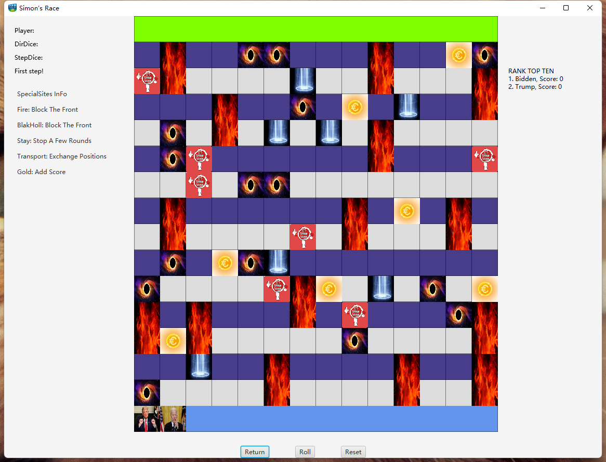

# JavaProject

## Board Game (A+ Project)

A java project dedicated to creating a board game. 

### Execution

Run `Main.java` in this repository to launch the main view.

### Main View

    

In the main view:
- Select the **Start Game** button to enter the difficulty selection screen and choose the desired difficulty.
- Opt for **Customized Game** to tailor your game experience. Add players, set the number of rows and columns, and position obstacles.

### Game View

    

In the game view:
- **Decision**: Use the Enter key or Left mouse button.
- **Roll Button**: Click to move the player randomly in an arbitrary direction.
- **Reset Button**: Refreshes the current view.
- **Return Button**: Navigates back to the main view.

The game will automatically terminate upon winning or by clicking the Close button in the upper right corner.

### Testing

In the `Test` file, evaluations are conducted on the game's core logic. Similarly, every view in the game undergoes testing.
